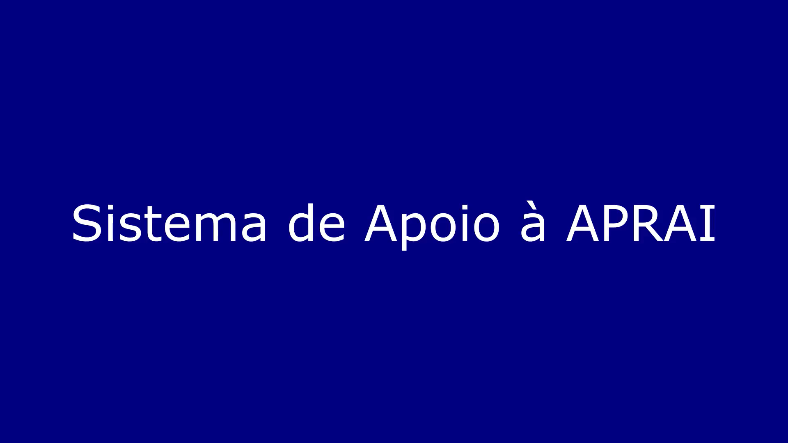

# Sistema de Apoio à APRAI

### Descrição
Projeto feito seguindo o framework Scrum para as disciplinas de Engenharia de Software - SCC0130 e de Introdução ao Desenvolvimento Web - SCC0219 do ICMC-USP, em colaboração com a ONG Associação de proteção aos animais de Indaiatuba (APRAI).
Consiste em um site para divulgação das ações da associação, junto com um sistema para facilitar atividades administrativas.


### Equipe

Project Owner:
*	Gustavo Bhering Grande
 
Scrum Master:
*	Albert Katayama Shoji
 
Desenvolvedores:

* Enzo Yasuo Hirano Harada
*	Lélio Marcos Rangel Cunha
*	Lucas Oliveira Castro
* Miguel Bragante Henriques


### Vídeo de Demonstração

Veja o vídeo de demonstração, abaixo, no YouTube!

[](https://www.youtube.com/watch?v=XvRD3UeiEns)

---

## Execução do Projeto
### Requisitos
Para executar o projeto, devem estar instalados:
- [Node.js e npm](https://docs.npmjs.com/downloading-and-installing-node-js-and-npm)

### Backend
Crie um arquivo **.env** no diretório `/backend/` com os seguintes valores:
```
PORT= #Escolha um port para hospedar o backend. Ex: 8080
DB_URI= #Valor secreto
BCRYPT_SALT_ROUNDS= #Valor secreto
JWT_SECRET= #Valor secret
```

Em seguida podemos hospedar o backend. Abra uma instância de terminal no diretório `/backend/`. Execute o comando `npm install` para garantir que os pacotes necessários estão instalados. Execute o comando `npm start` para hospedar o backend na porta escolhida. Aguarde as mensagens de confirmação no terminal.

### Frontend
Crie um arquivo **.env** no diretório `/frontend/` com os seguintes valores:
```
VITE_BACKEND_URL= Insira o url do backend. Ex: http://localhost:8080
```

Em seguida, podemos hospedar o frontend. Abra uma instância de terminal na pasta */frontend/*. Execute o comando `npm install` para garantir que os pacotes necessários estão instalados. Execute o comando `npm run dev` para hospedar o frontend na porta 5173.

Agora é possível acessar a página na url **http://localhost:5173**.
