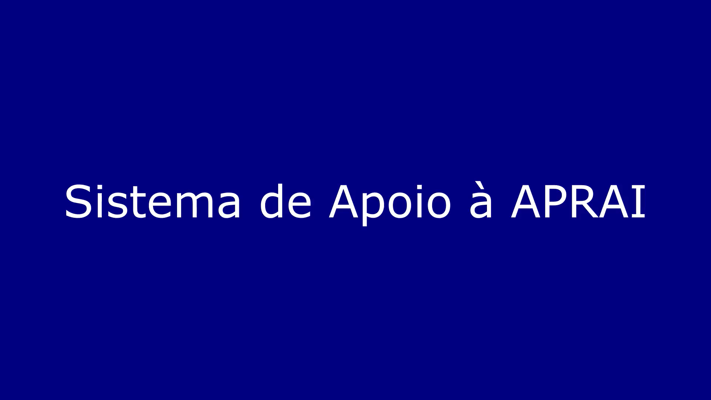

# Sistema de Apoio à APRAI

### Descrição
Projeto feito seguindo o framework Scrum para as disciplinas de Engenharia de Software - SCC0130 e de Introdução ao Desenvolvimento Web - SCC0219 do ICMC-USP, em colaboração com a ONG Associação de proteção aos animais de Indaiatuba (APRAI).
Consiste em um site para divulgação das ações da associação, junto com um sistema para facilitar atividades administrativas.


### Equipe

Project Owner:
*	Gustavo Bhering Grande
 
Scrum Master:
*	Albert Katayama Shoji
 
Desenvolvedores:

* Enzo Yasuo Hirano Harada
*	Lélio Marcos Rangel Cunha
*	Lucas Oliveira Castro
* Miguel Bragante Henriques


### Vídeo de Demonstração

Veja o vídeo de demonstração, abaixo, no YouTube!

[](https://www.youtube.com/watch?v=XvRD3UeiEns)

---

## Execução do Projeto
### Requisitos
Para executar o projeto, devem estar instalados:
- [Node.js e npm](https://docs.npmjs.com/downloading-and-installing-node-js-and-npm)
- [MinIO](https://min.io/)

### MinIO
Primeiro deve ser executado o armazenamento de objetos MinIO. Siga o guia oficial para [Windows](https://min.io/docs/minio/windows/index.html), [Linux](https://min.io/docs/minio/linux/index.html) ou [MacOS](https://min.io/docs/minio/macos/index.html) para poder instalar/hospedar uma instância local do MinIO e gerar uma chave de acesso e uma chave secreta. A porta padrão de execução será 9000. Crie um bucket blog-images e defina a política de acesso como:
```
{
    "Version": "2012-10-17",
    "Statement": [
        {
            "Effect": "Allow",
            "Principal": {
                "AWS": [
                    "*"
                ]
            },
            "Action": [
                "s3:GetBucketLocation",
                "s3:ListBucket"
            ],
            "Resource": [
                "arn:aws:s3:::blog-images"
            ]
        },
        {
            "Effect": "Allow",
            "Principal": {
                "AWS": [
                    "*"
                ]
            },
            "Action": [
                "s3:GetObject"
            ],
            "Resource": [
                "arn:aws:s3:::blog-images/*"
            ]
        }
    ]
}
```

### Backend
Crie um arquivo **.env** no diretório */backend/* com os seguintes valores:
```
PORT= #Escolha um port para hospedar o backend. Ex: 8080
DB_URI= #Valor secreto
BCRYPT_SALT_ROUNDS= #Valor secreto
JWT_SECRET= #Valor secret
MINIO_PORT= #Insira a porta em que MinIO foi hospedado. Ex: 9000
MINIO_ENDPOINT= #Insira o endpoint em que o MinIO foi hospedado. Ex: localhost
MINIO_ACCESS_KEY= #Insira a chave de acesso gerada no browser do MinIO.
MINIO_SECRET_KEY= #Insira a chave secreta gerada no browser do MinIO.
```

Em seguida podemos hospedar o backend. Abra uma instância de terminal no diretório */backend/*. Execute o comando `npm install` para garantir que os pacotes necessários estão instalados. Execute o comando `node ./src/server.js` para hospedar o backend na porta escolhida no .env. Aguarde as mensagens de confirmação no terminal.

### Frontend
Crie um arquivo **.env** no diretório */frontend/* com os seguintes valores:
```
VITE_BACKEND_URL= Insira o url do backend. Ex: http://localhost:8080
```

Em seguida, podemos hospedar o frontend. Abra uma instância de terminal na pasta */frontend/*. Execute o comando `npm install` para garantir que os pacotes necessários estão instalados. Execute o comando `npm run dev` para hospedar o frontend na porta 5173.

Agora é possível acessar a página na url **http://localhost:5173** 
